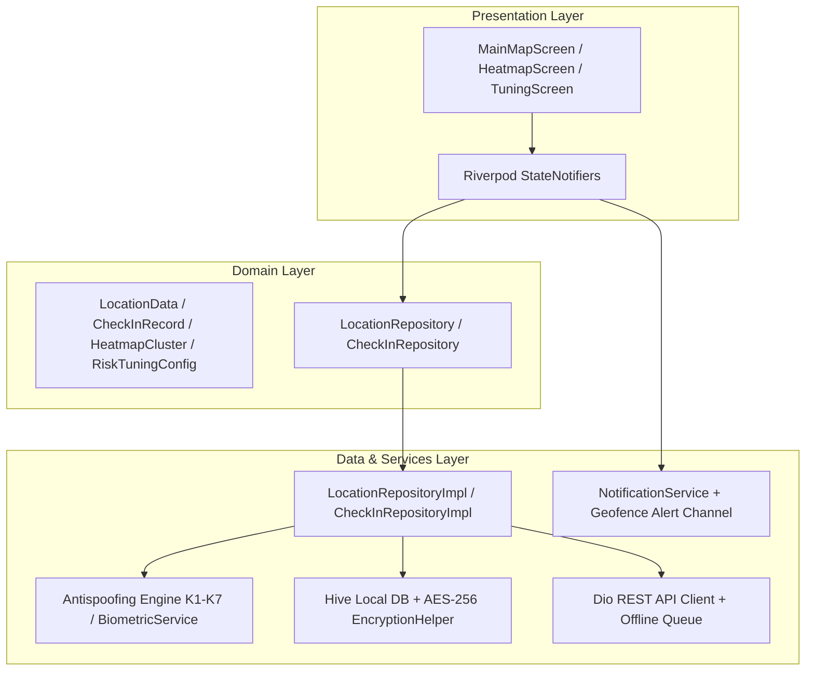

# Waypoint Safe Check-in Application 🛰️🛡️

<div align="center">

[](https://github.com/ezgiderici26/waypoint_app/actions/workflows/ci_cd.yml)


<p align="center">
  <b>Gelişmiş Konum Doğrulama (Antispoofing K1-K7), Biyometrik Onay, Çok Katmanlı Isı Haritası (Heatmap), Arka Plan Geofence Bildirimleri ve Dinamik Risk Kalibrasyonuna Sahip Kurumsal Flutter Uygulaması</b>
</p>

</div>

---

## 📱 Ekran Görüntüleri (Visual Showcase)

<div align="center">
<table>
  <tr>
    <td align="center" width="33%">
      <br/>
      <b>📍 1. Canlı Harita & Geofence HUD</b>
    </td>
    <td align="center" width="33%">
      <br/>
      <b>🚨 2. Sahte Konum & Saldırı Alarmı</b>
    </td>
    <td align="center" width="33%">
      <br/>
      <b>🔥 3. Çok Katmanlı Isı Haritası (Heatmap)</b>
    </td>
  </tr>
  <tr>
    <td align="center" width="33%">
      <br/>
      <b>🎛️ 4. Dinamik K1-K7 Kalibrasyon & Sandbox</b>
    </td>
    <td align="center" width="33%">
      <br/>
      <b>🔔 5. Arka Plan Bildirim & Olay Günlüğü</b>
    </td>
    <td align="center" width="33%">
      <br/>
      <b>🔐 6. AES-256 Şifreli Geçmiş & Senkron</b>
    </td>
  </tr>
</table>
</div>

---

## 🛡️ Antispoofing & Güvenlik Katsayıları Matrisi ($K1 - K7$)

Uygulama, her konum güncellemesinde aşağıdaki 7 bağımsız güvenlik katsayısını değerlendirir ve normalize edilmiş bir **Risk Skoru (0 - 100)** hesaplar:

| Katsayı | Güvenlik Denetimi | Tespit Mekanizması | Varsayılan Ağırlık | Durum |
| :---: | :--- | :--- | :---: | :---: |
| **$K1$** | **OS Mock Provider Flag** | Android `isFromMockProvider` / iOS `isSimulated` bayrağı | **+75 Puan** | 🔴 Kritik |
| **$K2$** | **Mock GPS Uygulama Paketi** | Sistem Mock konum test sağlayıcı paketleri kontrolü | **+50 Puan** | 🟠 Yüksek |
| **$K3$** | **Geliştirici Modu & USB Debugging** | ADB / Developer Options aktifliği | **+35 Puan** | 🟡 Orta |
| **$K4$** | **İmkânsız Hız / Işınlanma** | Haversine mesafe / zaman türevi ($> 150\text{ km/h}$) | **+70 Puan** | 🔴 Kritik |
| **$K5$** | **Sensör Çapraz Doğrulaması** | Fiziksel ivmeölçer (`UserAccelerometer`) vs GPS ivmesi | **+40 Puan** | 🟡 Orta |
| **$K6$** | **Cihaz Bütünlüğü** | Root / Jailbreak / Emülatör donanım ihlali | **+60 Puan** | 🟠 Yüksek |
| **$K7$** | **Ağ Güvenliği (VPN / Proxy)** | `tun0`, `ppp0`, `p2p` sanal ağ arayüzü tespiti | **+45 Puan** | 🟡 Orta |

### 🚦 Karar ve Güvenlik Eşikleri:
* 🟢 **0 - 34: GÜVENLİ** ➔ Check-in işlemine izin verilir.
* 🟡 **35 - 69: ŞÜPHELİ** ➔ Check-in kilitlenir, ek doğrulama istenir.
* 🔴 **70 - 100: SAHTE / ENGELLENDİ** ➔ İşlem tamamen engellenir ve alarm logu üretilir.

---

## 🏛️ Mimari Yapı (Clean Architecture & Riverpod)



---

## 🚀 Öne Çıkan Özellikler

### 1. 🌡️ Yönetici Isı Haritası (Heatmap) & Güvenlik Analitiği
* **Çok Katmanlı Radyal Isı Görselleştirmesi:** Google Maps üzerinde 4 katmanlı radyal gradyan çemberler (`Circle`).
* **Yoğunluk Modu:** Check-in sayısına göre Mavi ➔ Yeşil ➔ Turuncu ➔ Alev Kırmızısı renk skalası.
* **Risk / Tehdit Modu:** Sahte konum saldırısı veya VPN ihlali olan bölgelerde kırmızı tehdit aurası.
* **Yönetici KPI Göstergeleri:** Toplam check-in, engellenen saldırı adedi, güvenlik oranı (%), en yoğun hotspot ve donanım ihlalleri.
* **Hızlı Şehir Geçişleri:** Kadıköy, Beşiktaş, Taksim, Levent ve Maslak odak butonları.

### 2. 🔔 Geofence Bildirimleri ve Arka Plan Takibi
* Hedef geofence alanına girildiğinde (`ENTRY`) `"📍 Hedef Alana Girdiniz!"`, çıkıldığında (`EXIT`) `"🚪 Hedef Alandan Çıktınız"` push bildirimleri.
* Gerçekleşen olayların saat ve mesafe bazlı **Geofence Olay Günlüğü**.
* Android 13+ `POST_NOTIFICATIONS`, `ACCESS_BACKGROUND_LOCATION` ve `FOREGROUND_SERVICE_LOCATION` izinleriyle tam uyum.

### 3. 🎛️ Dinamik Risk Tuning & Kalibrasyon Paneli
* $K1 \dots K7$ katsayılarını ve güvenlik eşiklerini çalışma zamanında slider'lar ile anlık kalibre edebilme.
* Hazır profiller: `🛡️ Dengeli`, `🔒 Katı Kurumsal`, `⚡ Saha Testi`, `🧪 Özel`.
* **Canlı Kalibrasyon Sandbox:** Anomalileri arayüzden açıp kapatarak ortaya çıkan toplam skoru (`0-100`) ve kararı anında izleme.
* Tüm ayarların Hive `settings_box` ile kalıcı saklanması.

### 4. 🔐 Biyometri & AES-256 Şifreli Çevrimdışı Depolama
* Biyometrik parmak izi / yüz tanıma (`local_auth`) ile iki aşamalı doğrulama.
* Tüm check-in kayıtları ve cihaz donanım imzaları AES-256 CBC ile şifrelenir.
* İnternet veya sunucu kesintilerinde kayıtlar yerel kuyrukta toplanır, bağlantı gelince tek tıkla senkronize edilir.

### 5. ⚙️ Otomatik CI/CD Boru Hattı (GitHub Actions)
* Her `push` ve `pull_request` işleminde:
  1. `dart format` ve `flutter analyze` statik kalite kontrolleri.
  2. 23 adet birim/widget testinin icrası ve `lcov.info` test kapsam raporu üretimi.
  3. Android Release APK (`app-release.apk`) derlenip GitHub Artifacts'e yüklenmesi.

---

## 🛠️ Kurulum ve Yapılandırma

### 🔑 Google Maps API Key Yapılandırması
API anahtarının güvenliği için repo hijyeni mekanizması kurulmuştur:
1. `android/local.properties` dosyasını açın:
2. En alta kendi anahtarınızı ekleyin:
   ```properties
   MAPS_API_KEY=AIzaSyYourActualGoogleMapsAPIKeyHere
   ```
3. Uygulamayı çalıştırın. Gradle anahtarı `AndroidManifest.xml` içerisine güvenle enjekte edecektir.

---

## 🧪 Test Etme Kılavuzu

### 1. Otomatik Testlerin Çalıştırılması
```powershell
flutter test
```
*(Birim, Geofence, Heatmap, Dinamik Tuning, AES-256 Şifreleme ve Smoke testleri dahil toplam 23 test koşulur).*

### 2. 📱 Manuel Simülasyon Test Adımları
Uygulama içinde yer alan **Simülasyon Modu** ile donanıma veya Fake GPS uygulamasına gerek kalmadan tüm senaryolar test edilebilir:

1. **Uygulamayı Başlatın:** `flutter run`
2. **Ayarlar Sekmesini Açın:**
   * **Sahte Konum Tetikle (K1):** Harita üstünde kırmızı tehdit uyarısı yanar ve check-in kilitlenir.
   * **İmkânsız Hız Tetikle (K4):** Işınlanma uyarısı çıkar (185 km/s).
   * **Alana Giriş Simüle Et:** `"📍 Hedef Alana Girdiniz!"` push bildirimi düşer ve **Check-in Yap** butonu açılır.
   * **Alandan Çıkış Simüle Et:** `"🚪 Hedef Alandan Çıktınız"` bildirimi düşer.
3. **Isı Haritası Sekmesini Açın:**
   * Sağ üstteki **🧪 (Beher)** butonuna basarak 22 demo kümesini yükleyin, modlar arasında geçiş yapın.
4. **Dinamik Tuning Paneline Girin:**
   * K1-K7 slider'larını kaydırın, canlı sandbox üzerinde simülasyon yapın ve kaydedin.
