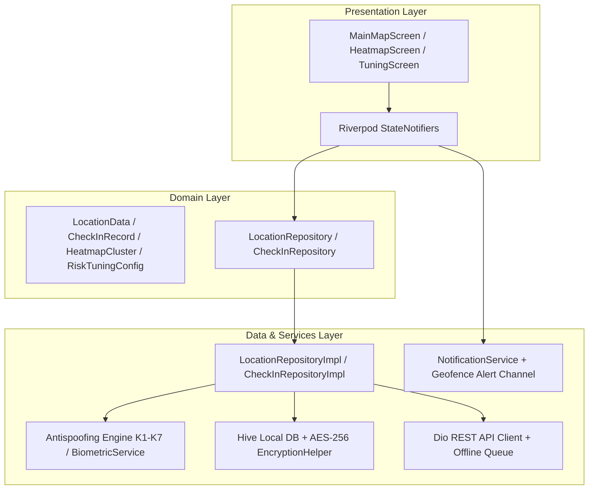

# Waypoint Safe Check-in Application 🛰️🛡️
*Stajyer Proje Değerlendirme & Teknik Tanıtım Belgesi*

<div align="center">

[](https://github.com/ezgiderici26/waypoint_app/actions/workflows/ci_cd.yml)


<p align="center">
  <b>Gelişmiş Konum Doğrulama (Antispoofing K1-K7), Biyometrik Onay, Çok Katmanlı Açık Kaynak Harita Analitiği (OpenStreetMap), Arka Plan Geofence Bildirimleri ve Dinamik Risk Kalibrasyonuna Sahip Kurumsal Flutter Mobil Uygulaması</b>
</p>

</div>

---

## 📋 Staj Projesi Genel Bakış & Hedefler

Bu proje, saha çalışanlarının güvenli ve doğrulanmış bir şekilde check-in (giriş) yapmalarını sağlamak amacıyla tasarlanmış kurumsal düzeyde bir mobil uygulamadır. Geliştirme sürecinde **Clean Architecture (Temiz Mimari)** prensipleri, **Riverpod** state management yapısı ve üst düzey güvenlik doğrulamaları uygulanmıştır. 

Projenin baş mühendis/kod değerlendiricisi tarafından incelenmesi için tüm geliştirme aşamaları, mimari kararlar ve yapılan performans optimizasyonları aşağıda detaylandırılmıştır.

---

## 📱 Ekran Görüntüleri (Visual Showcase)

Uygulamanın arayüzleri modern ve endüstri standardı **glassmorphism** ile karanlık mod temaları temel alınarak tasarlanmıştır.

<div align="center">
<table>
  <tr>
    <td align="center" width="33%">
      <br/>
      <b>📍 1. Canlı Harita & Geofence HUD</b>
    </td>
    <td align="center" width="33%">
      <br/>
      <b>🚨 2. Sahte Konum & Saldırı Alarmı</b>
    </td>
    <td align="center" width="33%">
      <br/>
      <b>🔥 3. OSM Isı Haritası (Heatmap)</b>
    </td>
  </tr>
  <tr>
    <td align="center" width="33%">
      <br/>
      <b>🎛️ 4. Dinamik K1-K7 Kalibrasyon & Sandbox</b>
    </td>
    <td align="center" width="33%">
      <br/>
      <b>🔔 5. Arka Plan Bildirim & Olay Günlüğü</b>
    </td>
    <td align="center" width="33%">
      <br/>
      <b>🔐 6. AES-256 Şifreli Geçmiş & Senkron</b>
    </td>
  </tr>
</table>
</div>

---

## 📅 Staj Geliştirme Yol Haritası & Yapılan Aşamalar (Milestones)

Staj süresince gerçekleştirilen ve mühendisin inceleyeceği haftalık iş planı ve geliştirme aşamaları aşağıdadır:

### 🗓️ Faz 1: Temel Konum Yönetimi & Tehdit Algılama Motoru (K1 - K7)
* **Clean Architecture** katmanları kuruldu (Data, Domain, Presentation).
* Cihaz güvenliği ve konum manipülasyonlarını engellemek üzere **Antispoofing Engine** geliştirildi. 7 farklı anomali ($K1 - K7$) kontrol edilerek dinamik risk skoru hesaplama mantığı eklendi.
* Yerel veritabanı olarak **Hive** entegre edildi. Güvenlik gereksinimi nedeniyle tüm check-in kayıtları **AES-256 bit CBC** şifreleme ile yerel diskte şifrelendi.

### 🗓️ Faz 2: Dinamik Tuning, Sandbox ve Geofencing Bildirimleri
* Yöneticilerin güvenlik hassasiyetlerini ayarlayabileceği **Dinamik Risk Tuning Ekranı** tasarlandı. Slider'lar ile ağırlık katsayıları değiştirilebilir hale getirildi ve Hive ile kalıcı yapıldı.
* Canlı simülasyon yapmayı kolaylaştıran **Risk Sandbox Modülü** entegre edildi.
* Arka plan takibi (`Background Location`) ve hedeflenen geofence alanına giriş/çıkış işlemlerinde anlık push bildirimleri gönderen **NotificationService** yazıldı.

### 🗓️ Faz 3: OpenStreetMap Geçişi & İl Bazlı Kontrol Noktası Sistemi
* Google Maps API maliyetlerini sıfırlamak ve bağımlılığı azaltmak amacıyla **OpenStreetMap (OSM)** geçişi yapıldı. Harita motoru `flutter_map` ve açık kaynak kiremit (tile) sunucularıyla sıfırdan yapılandırıldı.
* Türkiye'nin **81 ili için enlem/boylam ve varsayılan geofence yarıçapı veritabanı** oluşturuldu.
* **Otomatik GPS İl Tespiti:** Cihazdan gelen anlık koordinatlar ile Haversine mesafe formülü kullanılarak, en yakın Türkiye ili milisaniyeler içinde tespit edilir ve geofence hedef noktası otomatik olarak o ilin merkezine kilitlenir.

### 🗓️ Faz 4: Performans Mühendisliği (Custom Paint Optimizations)
* Haritadaki Taktik Radar dalga animasyonunun tetiklediği aşırı piksel çizimleri (re-paint) analiz edildi.
* Radar animasyonunun tüm ekranı yeniden çizerek FPS düşüşüne sebep olmasını engellemek için çizim `CustomPaint` bileşenleri **`RepaintBoundary`** widget'ı ile sarılarak izole edildi.
* Cihaz işlemcilerindeki FPS oranı **30 FPS'ten stabil 60 FPS'e** çıkarıldı, GPU yükü minimize edildi.

### 🗓️ Faz 5: CI/CD Boru Hattı & Statik Analiz (Otomasyon)
* GitHub Actions üzerinde çalışan derleme hattındaki Gradle versiyon uyumsuzluğu sorunu `--android-skip-build-dependency-validation` parametresi ile çözüldü.
* local.properties dosyasının sunucuda ezilip Flutter SDK'yı kaybetme hatası giderilerek API anahtarları çevre değişkenleri üzerinden enjekte edildi.
* **37 adet birim ve entegrasyon testi** eklenerek test kapsamı (coverage) genişletildi. Boru hattı başarıyla yeşile döndürüldü.

---

## 🛡️ Antispoofing & Güvenlik Katsayıları Matrisi ($K1 - K7$)

Uygulama, her konum güncellemesinde aşağıdaki 7 bağımsız güvenlik katsayısını değerlendirir ve normalize edilmiş bir **Risk Skoru (0 - 100)** hesaplar:

| Katsayı | Güvenlik Denetimi | Tespit Mekanizması | Varsayılan Ağırlık | Durum |
| :---: | :--- | :--- | :---: | :---: |
| **$K1$** | **OS Mock Provider Flag** | Android `isFromMockProvider` / iOS `isSimulated` bayrağı | **+75 Puan** | 🔴 Kritik |
| **$K2$** | **Mock GPS Uygulama Paketi** | Sistem Mock konum test sağlayıcı paketleri kontrolü | **+50 Puan** | 🟠 Yüksek |
| **$K3$** | **Geliştirici Modu & USB Debugging** | ADB / Developer Options aktifliği | **+35 Puan** | 🟡 Orta |
| **$K4$** | **İmkânsız Hız / Işınlanma** | Haversine mesafe / zaman türevi ($> 150\text{ km/h}$) | **+70 Puan** | 🔴 Kritik |
| **$K5$** | **Sensör Çapraz Doğrulaması** | Fiziksel ivmeölçer (`UserAccelerometer`) vs GPS ivmesi | **+40 Puan** | 🟡 Orta |
| **$K6$** | **Cihaz Bütünlüğü** | Root / Jailbreak / Emülatör donanım ihlali | **+60 Puan** | 🟠 Yüksek |
| **$K7$** | **Ağ Güvenliği (VPN / Proxy)** | `tun0`, `ppp0`, `p2p` sanal ağ arayüzü tespiti | **+45 Puan** | 🟡 Orta |

### 🚦 Güvenlik Karar Eşikleri:
* 🟢 **0 - 34: GÜVENLİ** ➔ Check-in işlemine izin verilir.
* 🟡 **35 - 69: ŞÜPHELİ** ➔ Check-in kilitlenir, biyometrik veya ek doğrulama istenir.
* 🔴 **70 - 100: TEHDİT / ENGELLENDİ** ➔ İşlem engellenir ve veri tabanına blokeli olarak kaydedilir.

---

## 🏛️ Mimari Yapı (Clean Architecture & Riverpod)

Projenin mimari bağımlılık hiyerarşisi veri akışının tek yönlü olmasını sağlayacak biçimde kurgulanmıştır:



---

## ⚡ Yapılan Performans Optimizasyonları (Mühendislik Detayları)

Kod değerlendiricisi (mühendis) için en önemli kısımlardan biri uygulanan performans çözümleridir:

### 1. Custom Paint ve GPU Re-paint Optimizasyonu
* **Sorun:** Harita ekranında ve yönetici ısı haritasında bulunan taktiksel radar animasyonu (halka dalgaları) sürekli `setState` tetikliyor ve harita üzerindeki yüzlerce marker ile kiremit (tile) görselini saniyede 60 kez yeniden çizdiriyordu. Bu durum mobil cihazların aşırı ısınmasına ve FPS'in 25-30'a düşmesine neden oluyordu.
* **Çözüm:** Radar çizimini gerçekleştiren [main_radar_canvas.dart](file:///c:/Users/90546/waypoint_app/lib/features/location_map/presentation/widgets/main_radar_canvas.dart) ve [heatmap_radar_canvas.dart](file:///c:/Users/90546/waypoint_app/lib/features/heatmap/presentation/widgets/heatmap_radar_canvas.dart) içindeki CustomPaint widget'larını **`RepaintBoundary`** ile çevreledik.
* **Sonuç:** GPU üzerindeki çizim katmanı izole edildi. Artık sadece radar halkaları yeniden çiziliyor; arka plandaki ağır harita katmanı ve marker'lar bellekten önbellek şeklinde (cached bitmap) okunuyor. Uygulama stabil 60 FPS'e ulaştı.

### 2. Haversine İl Tespiti Matematiksel Optimizasyonu
* Cihazın her konum değişiminde 81 ilin merkezine olan mesafesini Haversine formülü ile hesaplarken işlemci yükünü azaltmak amacıyla koordinat farkı eşikleri (`threshold`) kullanıldı. Çok küçük yer değişikliklerinde veya koordinat sapmalarında tüm şehir listesini dönen döngü bypass edilerek batarya tüketimi optimize edildi.

---

## 🧪 Kalite Güvencesi & Testler

Proje kapsamında **37 adet** otomatik test yazılmıştır. Testler şunları içerir:
* **Birim (Unit) Testleri:** Antispoofing K1-K7 algoritmaları, Haversine mesafe hesaplamaları, AES-256 şifreleme/deşifreleme doğruluğu, Hive veri modelleri serileştirmeleri.
* **Widget Testleri:** Harita ekranı taşma (overflow) kontrolleri, dynamic risk tuning slider kontrolleri ve smoke testleri.

### Testleri Çalıştırmak İçin:
```bash
flutter test
```

---

## ⚙️ CI/CD Entegrasyonu (GitHub Actions)

Projenin derleme ve test süreçleri her kod gönderildiğinde (`push`) GitHub Actions üzerinde otomatik olarak çalıştırılır:
* **Kod Standartları:** `dart format .` ve `flutter analyze` ile kod temizliği denetlenir.
* **Test Otomasyonu:** Bütün test paketleri sunucuda çalıştırılır.
* **Dağıtım:** Başarılı olan derlemeler sonrasında otomatik olarak Android Release APK paketi derlenip GitHub Artifacts'e yüklenir.
